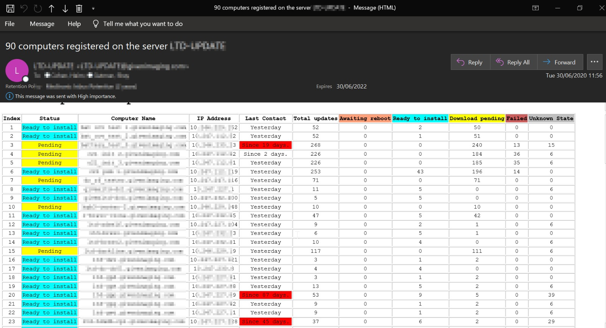
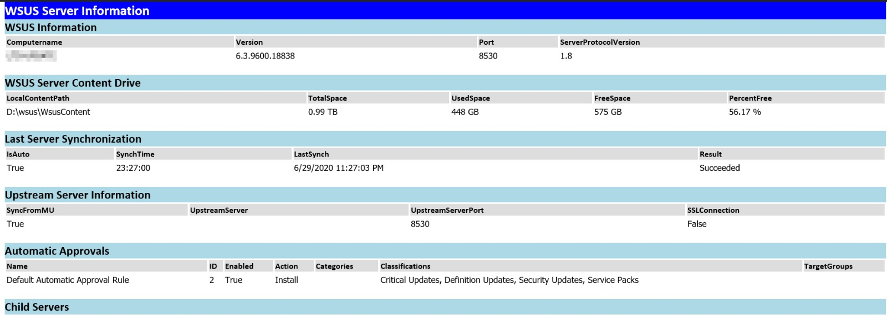

# wsus-mail-report

## A WSUS Report with a PowerShell Script

In both Powershell scripts you need to edit:

- the WSUS server name
- your SMTP Server
- the recipient smtp address
- the sender´s address

***

